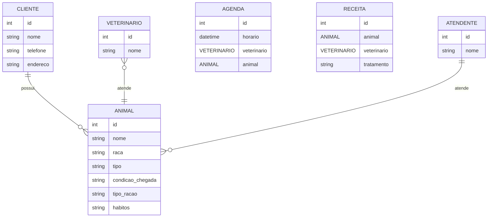
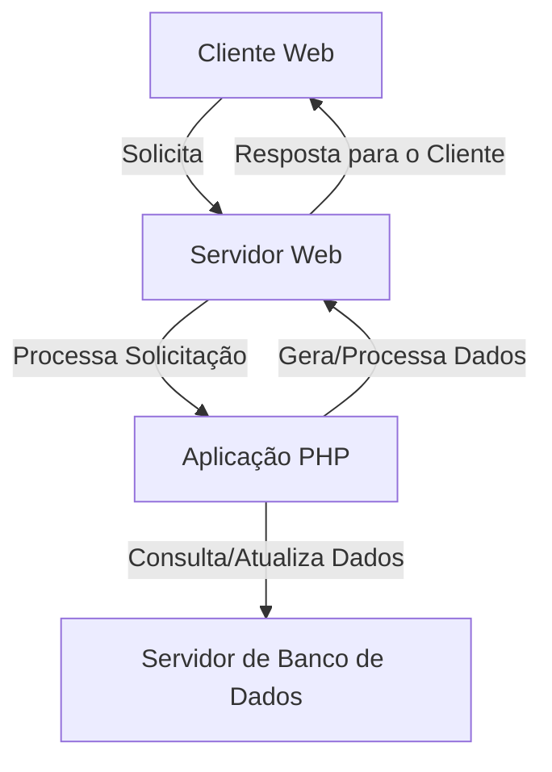

# Keven_schimitt

Keven Schimitt

# 1. Descricao do sistema

1-Uma clínica veterinária atende apenas os animais: gatos e cachorros. 
2-Os clientes devem fazer um cadastro de si e dos animais. 
3-Os clientes devem informar as condições nas quais os animais chegam. 
4-Os clientes devem informar o tipo de ração que o animal come. 
5-O cliente deve informar hábitos do animal. 
6-Para cada animal é possível que mais de um veterinário o atenda. 
7-Os animais podem chegar e serem atendidos de acordo com uma agenda do dia. 
8-Cada animal atendido receberá uma ficha e um prontuário. 
9-Outros dono podem querer marcar horários de atendimento futuro. 
10-O atendimento gera uma receita para o animal. 
11-Quando um cliente chega na clínica veterinária ele é atendido por um atendente. 
12-O atendente deve verificar se existe agenda disponível com um veterinário. 
13-O atendente deve colocar o cliente e seu animal na fila de espera, se for o caso. 
14-O atendente deve levar o cliente e o animal até o veterinário. 
15-O veterinário deve realizar uma entrevista com o dono do animal. 
16-O resultado da entrevista deve ir para um formulário. 
17-O veterinário deverá examinar o animal e anotar em prontuário(ficha) suas observações. 
18-Dependendo da situação do animal este receberá uma receita.
19-Não recebe animal morto.
20-O animal deve ser limpo antes de chegar.
21-O animal deve ser entregue para o veterinário.
22-Agendar hora para cães de raça.

1- Desenhe um diagrama Wntidade Relacionada usando Markdow e Mermaid.

A partir do diagrama Entidade Relacionamento acima gere um script SQL:

1- As tabelas do sistema com o comando CREATE.
2- 5 registros de exemplo para cada tabela com o comando INSERT.

# 2. Diagrama de banco de dados

# 3. Diagrama de casos de uso

# 4. Principais telas do sistema

# 5. Arquitetura do sistema

